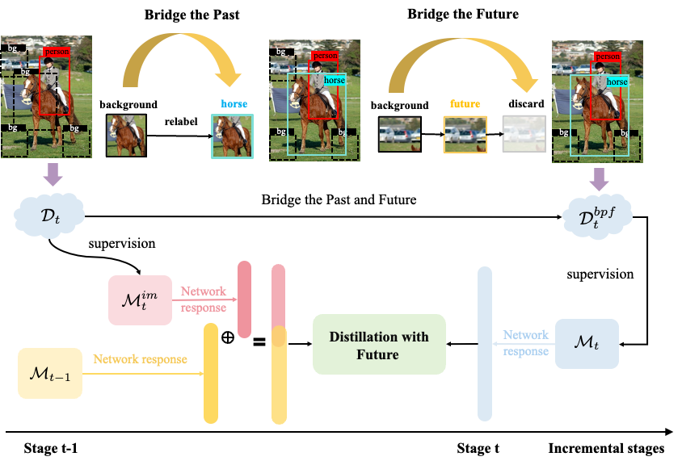

# Bridge Past and Future
**(ECCV 2024) Official repository of paper "Bridge Past and Future: Overcoming Information Asymmetry in Incremental Object Detection"**


## 🔥 News

- 2024/7/17: Our arxiv paper can be found [here](http://arxiv.org/abs/2407.11499)


## 🔍 Overview



**The overall framework of our method.** The top side illustrates the Bridge Past and Future (BPF) procedure, which identifies objects of past classes and excludes several potential objects of future classes to ensure consistent optimization during the entire training process. The bottom side shows the Distillation with Future (DwF) process, which employs both the old model $M_{t-1}$ adept at detecting old categories and the interim model $M_{t}^{im}$ trained on $D_t$ and specialized in new categories to conduct a comprehensive distillation across all categories for the current model $M_t$.


**Visualization of Bridge Past and Future.** Boxes in $\textcolor{red}{\text{red}}$ represent the ground truth in the current stage. **(a)** In Bridge the Past, we effectively constructed pseudo labels of past classes. **(b)** In Bridge the Future, salient objects (marked in $\textcolor{green}{\text{green}}$ boxes) can be easily detected from the attention maps and are excluded from the background regions. Best viewed in color.


## 📝 TODO List
- [x] Release the code.
- [ ] Release the checkpoint.
- [ ] Release the training script.


## 📖 Implementation

### I. Installation
#### Environment
 - Python == 3.7
 - PyTorch == 1.10.0

#### Dependencies

Install the dependencies from the `requirements.txt`:
```linux
pip install -r requirements.txt
```


**Please, follow the instruction provided by Detectron 1 and found in install.md**


### 2. Dataset

You can find the Pascal-VOC dataset already in Detectron.


### 3. Settings


### 4. Run

#### 4.1 Train the first task

For the setting of the Pascal-VOC dataset, the first task usually contains categories 5, 10, 15 and 19. So when we train the first task for different settings, we could only train four kinds of the first task. First, choosing the correspoinding task setting (e.g., `taks=10-10`) in the `scripts/run_firststep.sh` file according to your needs, and then run:

``` shell script
bash scripts/run_first_step.sh
```


#### 4.2 Train the intermediate model

``` shell script
bash scripts/run_finetune_step.sh
```


#### 4.3 Train the target model

``` shell script
bash scripts/run_incre_finetune.sh
```


### CHECKPOINT

We provide [checkpoint](https://drive.google.com/drive/folders/1AqFcBFQjtmpYpVDvqHkrX2xDjARkCH0V?usp=sharing) here.


## 👏 Acknowledgements

Our repository is based on the amazing work of @YuyangSunshine[ABR_IOD](https://github.com/YuyangSunshine/ABR_IOD) @fcdl94[MMA](https://github.com/fcdl94/MMA) and @CanPeng123 [FasterILOD](https://github.com/CanPeng123/Faster-ILOD) and on the [maskrcnn-benchmark](https://github.com/facebookresearch/maskrcnn-benchmark) library. We thank the authors and the contibutors of these projects for releasing their code.


## 🔗 Citation

If you find our work helpful, please cite:

```bibtex
@inproceedings{
   mo2024bridge,
   title={Bridge Past and Future: Overcoming Information Asymmetry in Incremental Object Detection},
   author={Mo, Qijie and Gao, Yipeng and Fu, Shenghao and Yan, Junkai and Wu, Ancong and Zheng, Wei-Shi},
   booktitle={ECCV},
   year={2024},
}
```
